## **Intro**

This is a Shiny app for Raw Data Preprocessing (Trimming), Differential
Expression Analysis (Mapping,Quantification, DESeq2) and Gene Set
Enrichment Analysis. Multiple tables and plots are produced from the
above processes.

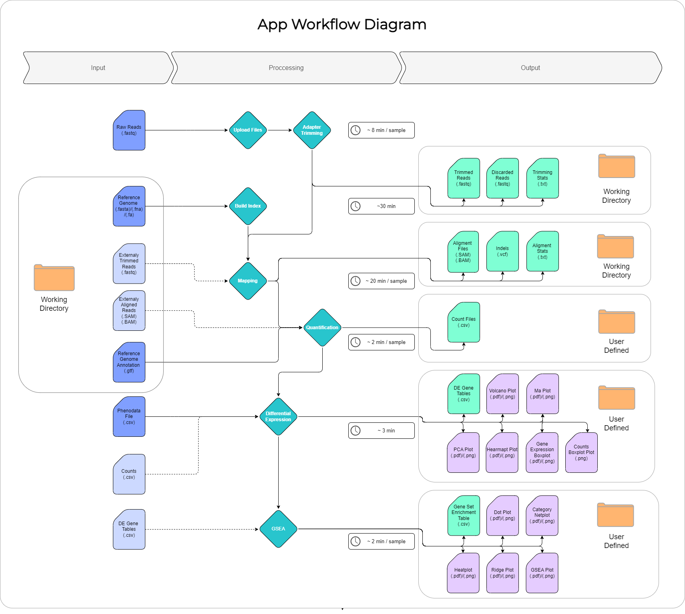{width="1200"}

### 

## **Features**

### Trimming process

1.  Upload your **raw data that should be unzipped and in .fastq
    format.** (It copies the uploaded files inside a sub directory of
    the trimming package). **(Upload files)**

2.  Choose the specific paired- end files that you want to trim each
    time **(Trimming process)**

3.  **The trimmed reads are saved automatically in the working
    directory, with the characteristic suffix: \_trimmed.fastq**

4.  After you finish with your analysis you can delete the files you
    previously uploaded. (It deletes all the files inside the sub
    directory).

    #### 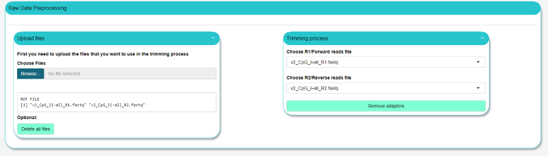

## 

### Mapping process

1.  For this step, you don't have to upload any files, **all the trimmed
    reads inside the working directory will be mapped**. If you have
    external trimmed reads, put them in the working directory.

2.  Make sure that you have saved the **reference genome .fasta/.fa file
    inside the working directory**.

3.  **Build the genome index, if you haven't already done it.** **When
    you are mapping for the first time! (Build index)**

4.  You can use the default settings for the alignment or customize
    them. **(Alignment process)**

5.  **The aligned reads are saved automatically in the working
    directory, with the characteristic suffix: .subread.SAM or .BAM**

### Quantification process

1.  For this step, you don't have to upload any files, **all the aligned
    reads in .SAM or .BAM format inside the working directory will be
    counted.** If you have external aligned reads, put them in the
    working directory.

2.  Make sure that you have saved the **reference genome .gtf file
    inside the working directory**.

3.  You can use the default settings for the quantification or customize
    them. **(Quantification process)**

4.  You can download the results in .csv format.

### Differential expression analysis

1.  Upload the .csv file that contains the counts. **(Upload the counts
    file )**

2.  **Option 1:** Upload the phenodata file in .csv format that contains
    information about each sample. **Make sure that the samples have the
    exact same name with the counts file and the same order ! (Upload
    the phenodata file)**

    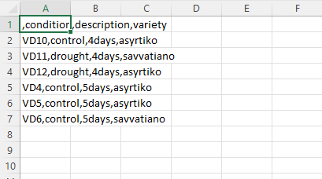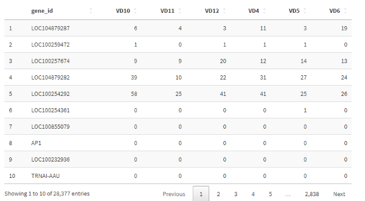

3.  **Option 2:** If you don't want to upload a phenodata csv file,
    **you can also create the phenodata dataframe in Simplar**. First of
    all you should select the number of columns and then type the column
    names and the conditions/factors of each column , separated by
    comma. The samples must match the conditions, so you should be
    careful of the order of the conditions. The order of the samples in
    the dataframe is like the order in the counts file. We can observe
    that the first sample in the counts table (above) is the same as in
    the phenodata dataframe (below). **(Create phenodata table)**

    .png)

4.  As soon as you upload the phenodata file you will be able to see all
    the column names in the design formula box. Choose the columns that
    you need for your analysis. **You can design a formula that contains
    from one till three factors.** **(DESeq2 object settings)**

5.  **You can specify the comparison of interest, and the levels to
    compare. The level given last is the base level for the
    comparison.** First you need to choose the contrast column and then
    press the "Update levels by your contrast choice" button. Then you
    can choose the levels of the contrast ,that are data from your
    contrast column. **(DESeq2 object settings)**

6.  You can use the default settings for the p-adjust and the
    log2FoldChange value or customize them. **(DESeq2 object settings**)

7.  You can download the results in csv format.

    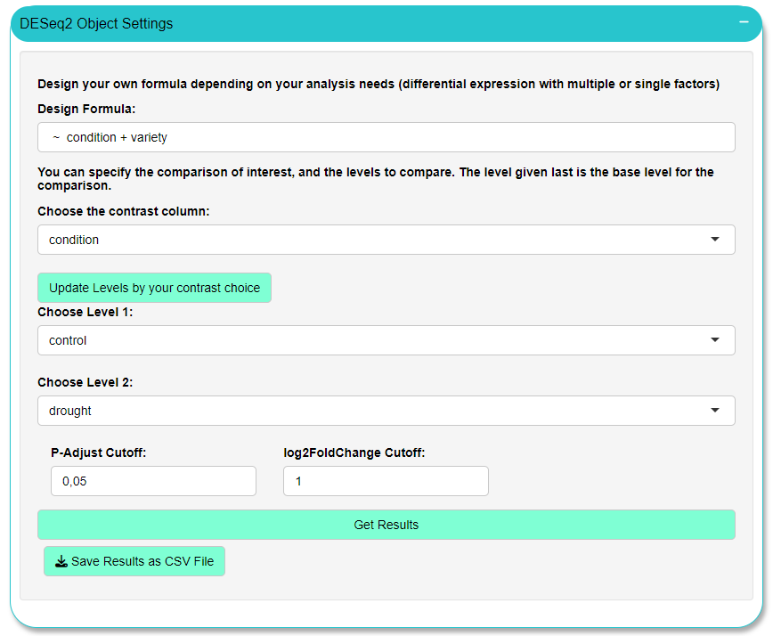

### Differential expression Plots

You can select colors for the Volcano plot, MA plot and Boxplot.

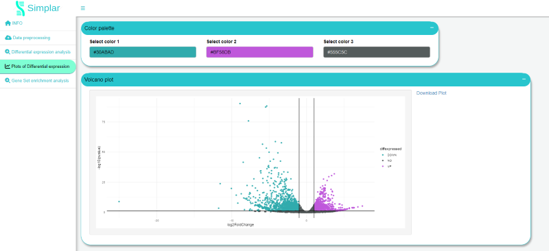

1.  **Volcano plot**: Visualization for the differentially expressed
    genes. Option to download it in .pdf format .

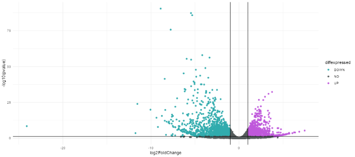

1.  **MA plot**: Visualization for the differentially expressed genes.
    Option to download it in .pdf format.

    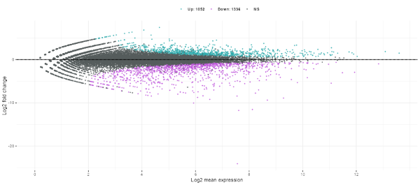

2.  **PCA plot**: Visualization for the differentially expressed genes
    after vst normalization. Option to download it in .pdf format.

    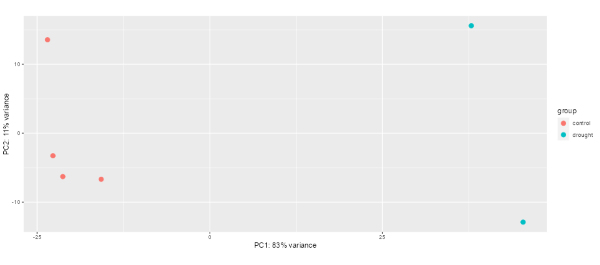

3.  **Heatmap**: Visualization for the 30 most variable genes after vst
    normalization. You can also select the number of categories to be
    visualized in the plot. First, you have to select the groups and
    then the number of categories. Option to download it in .pdf format.

    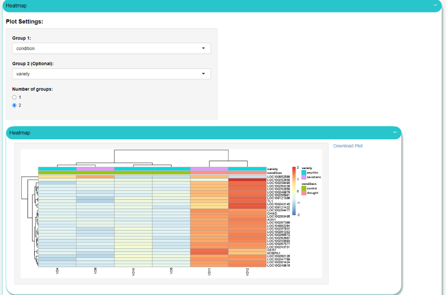

4.  **Gene Expression Boxplot**: You can select the gene names /ids ,
    the x axis group and a second contrast group. Option to download it
    in .pdf format

    

5.  **Counts Boxplot:** Visualization for the counts of each sample(from
    the uploaded counts file). You can select color palette. Option to
    download it in .png format (click on the image and save it as .png).

    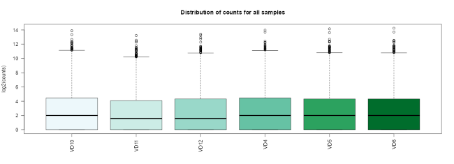

### Gene set enrichment analysis

1.  Upload the .csv produced by the differential expression analysis. If
    you upload a csv not produced by the app, **make sure that the
    column that contains the gene ids is named "gene_name" and the
    column that contains the log2 Fold Change results is named
    "log2FoldChange". (Upload Data)**

2.  I**f there is a pattern in front of the gene ids in the gene_name
    column** , aside from the LOC pattern that is removed automatically,
    **you should remove it** by writing the pattern in the appropriate
    box ("Give the pattern") and then checking the "Remove pattern" box.

    **BEFORE**

    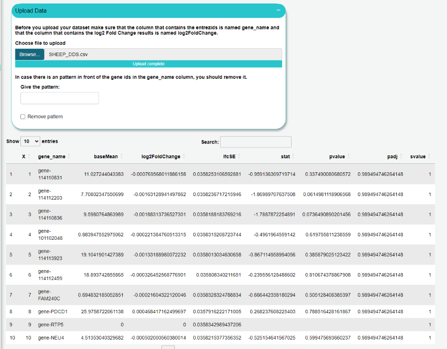

**AFTER**

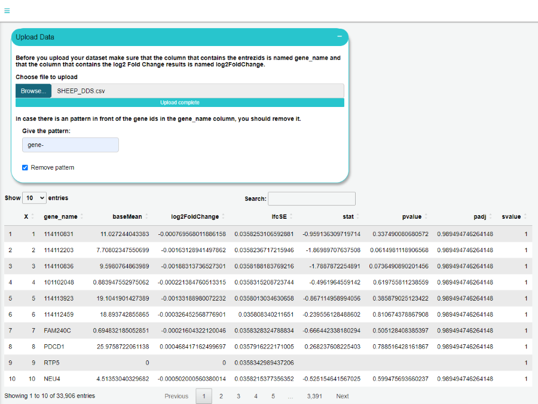

3.  Type the organism of your analysis in the "Select Organism:" box.
    Then press the search button.(**AnnotationHub Parameters**). Copy
    paste the AnnotationHub code in the "Select annotation file code:"
    box. Then press the download button. (**AnnotationHub Parameters**)

    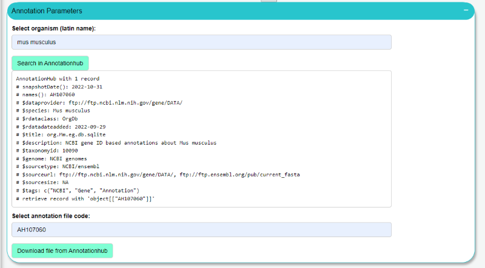

4.  You can use the default settings for the enrichment analysis or
    customize them. Make sure to **choose the appropriate name of the
    organism ( Organism short name)** . The organism's short name is a
    combination of the first letter of the first word of the original
    latine name, with the whole second word of the latine name. For
    example: the latin name for mouse is "mus musculus" so the short
    name will be "mmusculus". A second example: the latin name for human
    is "homo sapiens" so the short name will be "hsapiens". **(Gene Set
    Enrichment Object Parameters)**

    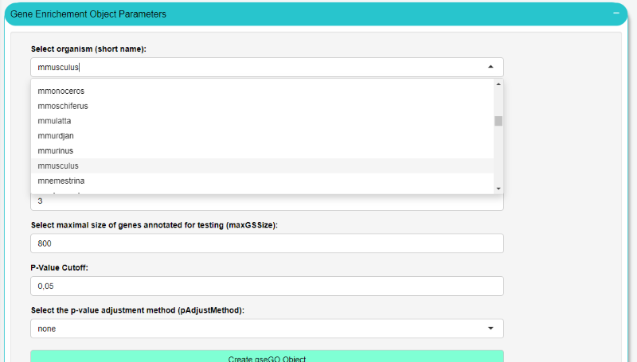

5.  You can download the results in .csv format.

6.  **Dot plot**: You can choose the number of categories to show.
    Option to download it in .pdf format

    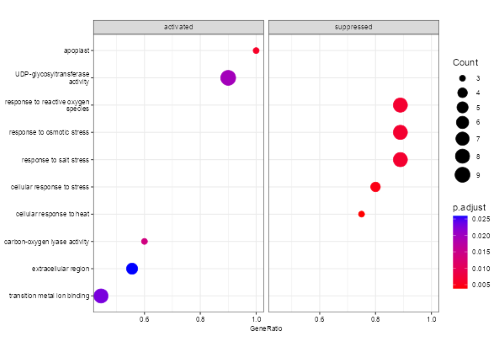

7.  **Category Netplot**: You can choose the number of categories to
    show. Option to download it in .pdf format

    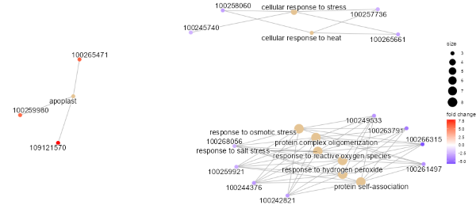

8.  **Heat plot**: Option to download it in .pdf format

    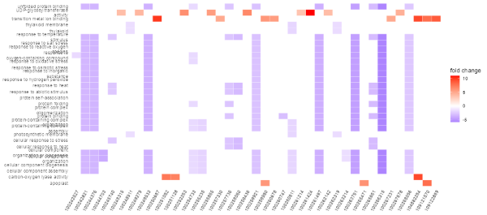

9.  **Ridge plot**: You can choose the number of categories to show.
    Option to download it in .pdf format

    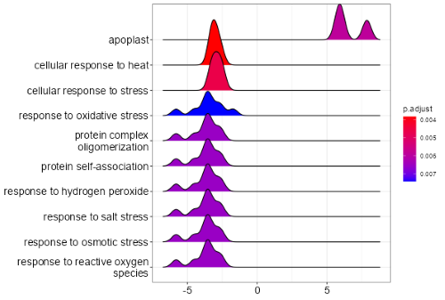

10. **GSEA plot**: Choose the gene set ID. Option to download it in .pdf
    format

    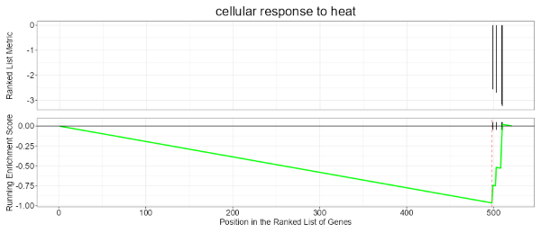

### **Packages**

-   Trimming: Rbowtie2(AdapterRemoval)

-   Mapping: Rsubread

-   Quantification: Rsubread(Feature Counts)

-   Differential Expression: DESeq2

-   Gene Set Enrichment: AnnotationHub, clusterProfiler
